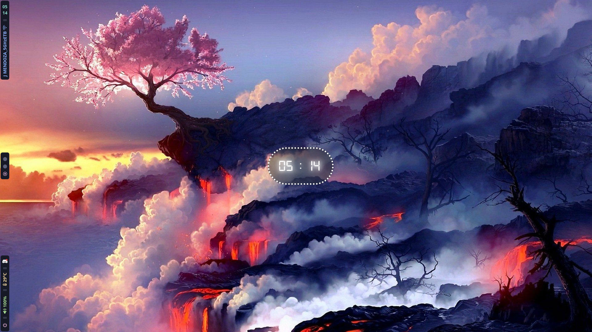
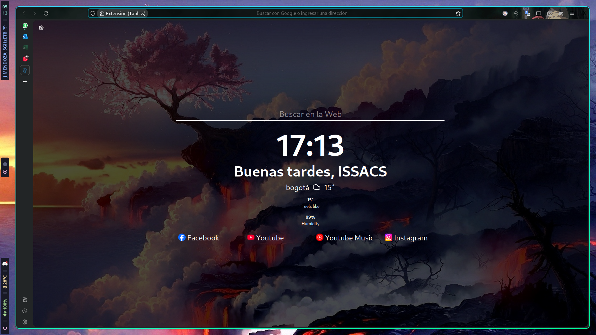

# Dotfiles hyprland archlinux

# Paquetes
- Firefox (navegador)
- Wofi (lanzador de aplicaciones)
- Swww (fondos de pantalla)
- Eww (widgets)
- Hyprland (gestor de ventanas)
- Waybar (barra de tareas)

  
# Caracteristicas

| 🌈 | 📸 |
| --- | --- |
| Wallpaper aleatorio |  |
| Firefox personalizado |  |
| Terminal kitty & fluides hyprland |  |
| wofi lanzador & power menu |  |

# Nota
- El cambio de wallpaper aleatorio hace uso de swww con el script en `custom_scripts/walt.sh` cambiar la "carpeta" por la ruta de sus wallpapers
- La configuracion de firefox se encuentra en `no-dotfiles/firefox/chrome` esta debe ser pegada en la carpeta raiz de su perfil firefox, al cual se puede acceder escribiendo en la bara URL `about:profiles`, tambien puede seguir las instrucciones del github FF-ULTIMA [https://github.com/soulhotel/FF-ULTIMA](https://github.com/soulhotel/FF-ULTIMA) siendo este el creador de este estilo para firefox
- Para agregar pokemons a la terminal uso [pokemon-colorscripts](https://gitlab.com/phoneybadger/pokemon-colorscripts)
- Si te gustaron los fondos, estos se encuentran alojados en [fondos-fav](https://github.com/ISSACS-jul/fondos-fav)

# 🌟 Disfruta modificando este sencillo ricing 🌟

